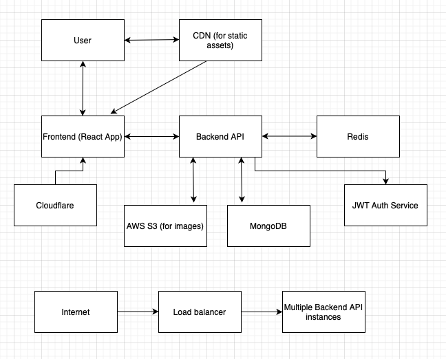

# DineDiscovery - Restaurant Record Application

## High-Level System Architecture

The system architecture consists of three main components:

1. Frontend:

   - React.js single-page application
   - Tailwind CSS for styling
   - Hosted on a CDN for fast global access

2. Backend:

   - Node.js with Express.js
   - RESTful API endpoints
   - JWT for authentication
   - Hosted on scalable cloud infrastructure (e.g., AWS Elastic Beanstalk)

3. Database:
   - MongoDB for flexible schema and scalability
   - Hosted on MongoDB Atlas for managed services

Additional components:

- Redis cache for improved read performance
- AWS S3 for image storage (if there are restaurant photos uploaded)
- Cloudflare for DDoS protection and CDN

## Tech Stack Rationale

### Frontend

- React.js: Chosen for its component-based architecture, which allows for reusable UI elements and efficient rendering through its virtual DOM. It also has a large ecosystem and community support.
- Tailwind CSS: Provides utility-first CSS, allowing for rapid UI development and easy customization. It also results in smaller CSS file sizes compared to traditional frameworks.

### Backend

- Node.js with Express.js: Provides a lightweight, flexible backend that can handle asynchronous operations efficiently. It shares the JavaScript language with the frontend, allowing for code reuse and easier full-stack development.
- RESTful API: Ensures a stateless, scalable architecture that's easy to extend and maintain.

### Database

- MongoDB: A NoSQL database that offers flexibility in data schema, which is beneficial for a product that may evolve rapidly. It also provides good scalability and performance for read-heavy operations.

### Additional Technologies

- Redis: Used as a caching layer to reduce database load and improve response times for frequently accessed data.
- AWS S3: Provides reliable, scalable storage for user-uploaded images.
- JWT (JSON Web Tokens): Offers a secure, stateless method for user authentication.

## Non-Functional Considerations

1. Performance:

   - CDN usage for static assets to reduce latency
   - Redis caching to improve read performance
   - Database indexing for faster queries
   - Lazy loading of images and pagination of restaurant lists

2. Security:

   - JWT for secure authentication
   - HTTPS for all communications
   - Input sanitization to prevent XSS attacks
   - Rate limiting to prevent brute force attacks
   - Regular security audits and dependency updates

3. Scalability:

   - Horizontally scalable backend using containerization (e.g., Docker)
   - Database sharding for handling large datasets
   - Load balancing for distributing traffic

4. Reliability:

   - Redundancy in cloud infrastructure
   - Regular backups of the database
   - Monitoring and alerting system for quick issue detection

5. Maintainability:

   - Clear code structure and documentation
   - Use of TypeScript for improved type safety and developer experience
   - Automated testing (unit, integration, and end-to-end tests)
   - CI/CD pipeline for streamlined deployments

6. Accessibility:

   - Adherence to WCAG guidelines
   - Keyboard navigation support
   - Screen reader compatibility

7. Internationalization:
   - Support for multiple languages using i18n libraries
   - Localized content and currency handling

This tech stack and architecture provide a solid foundation for building a scalable, performant, and secure restaurant wishlist application. The choices made allow for rapid development and easy scaling as the user base grows, while also considering important non-functional aspects of the system.

## Live Demo

The application is deployed and can be accessed at: [https://melodic-sprite-9d8d21.netlify.app](https://melodic-sprite-9d8d21.netlify.app)
